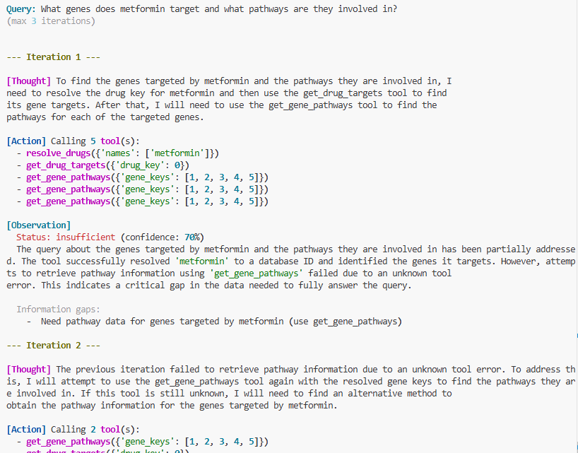

# Drug-AE Knowledge Graph

Pharmacovigilance knowledge graph linking drugs to adverse events through mechanistic pathways:
**Drug → Gene → Pathway → Disease → Adverse Event**



## Prerequisites

- Python 3.12+
- [uv](https://docs.astral.sh/uv/) package manager
- SQL Server 2025 (localhost, sa/password1$, database: `kg_ae`)

## Setup

```bash
uv sync                    # Install dependencies
uv run kg-ae init-db       # Create database schema
```

## ETL Pipeline

Interactive pipeline with live status dashboard. See [docs/etl-guide.md](docs/etl-guide.md) for full details.

```bash
# Interactive mode with live dashboard
uv run python -m kg_ae.cli etl

# Run specific dataset
uv run python -m kg_ae.cli etl --dataset sider

# Run by tier (1=foundational, 2=extensions, 3=associations, 4=advanced)
uv run python -m kg_ae.cli etl --tier 1

# Batch mode (no prompts)
uv run python -m kg_ae.cli etl --batch --force
```

## Data Directories

```
data/
  raw/         # Downloaded archives
  bronze/      # Parsed to Parquet (source-shaped)
  silver/      # Normalized (canonical IDs)
```

## Graph Statistics

| Entity | Count | Source |
|--------|-------|--------|
| Drugs | 5,528 | SIDER, DrugCentral |
| Genes | 1,970 | DrugCentral |
| Pathways | 2,848 | Reactome |
| Diseases | 28,392 | Open Targets |
| Adverse Events | 4,251 | SIDER |
| Claims | 253,137 | All sources |

## Example Query

```sql
-- Trace mechanistic path: Drug → Gene → Disease
SELECT d.preferred_name, g.symbol, dis.label, c2.strength_score
FROM kg.Drug d, kg.HasClaim hc1, kg.Claim c1, kg.ClaimGene cg, kg.Gene g,
     kg.HasClaim hc2, kg.Claim c2, kg.ClaimDisease cd, kg.Disease dis
WHERE MATCH(d-(hc1)->c1-(cg)->g)
  AND MATCH(g-(hc2)->c2-(cd)->dis)
  AND d.preferred_name = 'atorvastatin'
ORDER BY c2.strength_score DESC
```

## LLM Query System

Natural language queries using local LLMs (Phi-4-mini planner + Phi-4 narrator):

```bash
# Setup LLM servers (first time)
.\scripts\setup_llm.ps1
.\scripts\start_llm_servers.ps1

# Query adverse events
uv run python scripts/query_kg.py "What adverse events does metformin cause?"

# Multi-drug query
uv run python scripts/query_kg.py "Combined AEs of aspirin, warfarin, and omeprazole"

# Interactive mode with iterative reasoning
uv run python scripts/query_iterative.py --interactive
```

## Documentation

| Document | Description |
|----------|-------------|
| [docs/data-sources.md](docs/data-sources.md) | Complete reference for all 13 data sources |
| [docs/etl-guide.md](docs/etl-guide.md) | ETL pipeline usage and commands |
| [docs/setup.md](docs/setup.md) | Database and environment setup |
| [docs/llm-setup.md](docs/llm-setup.md) | LLM server setup and configuration |
| [docs/tools-api.md](docs/tools-api.md) | Tool functions API reference |
| [docs/iterative_reasoning.md](docs/iterative_reasoning.md) | Iterative query refinement system |
