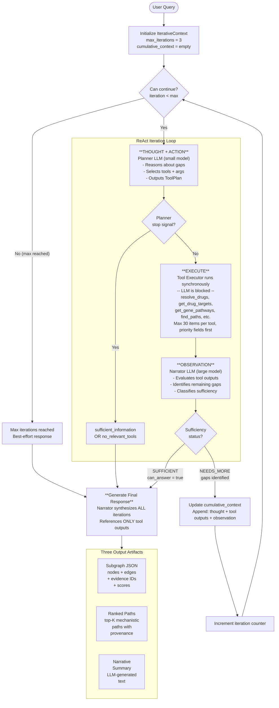

# Agent Control Flow: ReAct Iterative Loop

```mermaid
flowchart TD
    START(["User Query"])
    INIT["Initialize IterativeContext\nmax_iterations = 3\ncumulative_context = empty"]
    CHECK_CONTINUE{"Can continue?\niteration < max"}

    subgraph REACT_LOOP ["ReAct Iteration Loop"]
        direction TB
        THOUGHT["**THOUGHT + ACTION**\nPlanner LLM (small model)\n- Reasons about gaps\n- Selects tools + args\n- Outputs ToolPlan"]
        
        STOP_CHECK{"Planner\nstop signal?"}
        STOP_REASON["sufficient_information\nOR no_relevant_tools"]

        EXECUTE["**EXECUTE**\nTool Executor runs synchronously\n-- LLM is blocked --\nresolve_drugs, get_drug_targets,\nget_gene_pathways, find_paths, etc.\nMax 30 items per tool, priority fields first"]

        OBSERVE["**OBSERVATION**\nNarrator LLM (large model)\n- Evaluates tool outputs\n- Identifies remaining gaps\n- Classifies sufficiency"]

        SUFFICIENCY{"Sufficiency\nstatus?"}
    end

    UPDATE["Update cumulative_context\nAppend: thought + tool outputs + observation"]
    INCREMENT["Increment iteration counter"]

    MAX_ITER["Max iterations reached\nBest-effort response"]
    
    FINAL["**Generate Final Response**\nNarrator synthesizes ALL iterations\nReferences ONLY tool outputs"]

    subgraph OUTPUTS ["Three Output Artifacts"]
        direction LR
        O1["Subgraph JSON\nnodes + edges\n+ evidence IDs\n+ scores"]
        O2["Ranked Paths\ntop-K mechanistic\npaths with\nprovenance"]
        O3["Narrative\nSummary\nLLM-generated\ntext"]
    end

    START --> INIT --> CHECK_CONTINUE
    CHECK_CONTINUE -- Yes --> THOUGHT
    CHECK_CONTINUE -- "No (max reached)" --> MAX_ITER --> FINAL

    THOUGHT --> STOP_CHECK
    STOP_CHECK -- "Yes" --> STOP_REASON --> FINAL
    STOP_CHECK -- "No" --> EXECUTE
    EXECUTE --> OBSERVE
    OBSERVE --> SUFFICIENCY

    SUFFICIENCY -- "SUFFICIENT\ncan_answer = true" --> FINAL
    SUFFICIENCY -- "NEEDS_MORE\ngaps identified" --> UPDATE
    UPDATE --> INCREMENT --> CHECK_CONTINUE

    FINAL --> OUTPUTS
```
