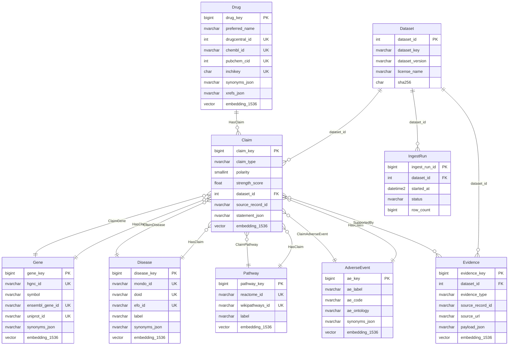

# Graph Data Schema: Claim-Evidence Pattern

```mermaid
erDiagram
    Drug {
        bigint drug_key PK
        nvarchar preferred_name
        int drugcentral_id UK
        nvarchar chembl_id UK
        int pubchem_cid UK
        char inchikey UK
        nvarchar synonyms_json
        nvarchar xrefs_json
        vector embedding_1536
    }

    Gene {
        bigint gene_key PK
        nvarchar hgnc_id UK
        nvarchar symbol
        nvarchar ensembl_gene_id UK
        nvarchar uniprot_id UK
        nvarchar synonyms_json
        vector embedding_1536
    }

    Disease {
        bigint disease_key PK
        nvarchar mondo_id UK
        nvarchar doid UK
        nvarchar efo_id UK
        nvarchar label
        nvarchar synonyms_json
        vector embedding_1536
    }

    Pathway {
        bigint pathway_key PK
        nvarchar reactome_id UK
        nvarchar wikipathways_id UK
        nvarchar label
        vector embedding_1536
    }

    AdverseEvent {
        bigint ae_key PK
        nvarchar ae_label
        nvarchar ae_code
        nvarchar ae_ontology
        nvarchar synonyms_json
        vector embedding_1536
    }

    Claim {
        bigint claim_key PK
        nvarchar claim_type
        smallint polarity
        float strength_score
        int dataset_id FK
        nvarchar source_record_id
        nvarchar statement_json
        vector embedding_1536
    }

    Evidence {
        bigint evidence_key PK
        int dataset_id FK
        nvarchar evidence_type
        nvarchar source_record_id
        nvarchar source_url
        nvarchar payload_json
        vector embedding_1536
    }

    Dataset {
        int dataset_id PK
        nvarchar dataset_key
        nvarchar dataset_version
        nvarchar license_name
        char sha256
    }

    IngestRun {
        bigint ingest_run_id PK
        int dataset_id FK
        datetime2 started_at
        nvarchar status
        bigint row_count
    }

    Drug ||--o{ Claim : "HasClaim"
    Gene ||--o{ Claim : "HasClaim"
    Disease ||--o{ Claim : "HasClaim"
    Pathway ||--o{ Claim : "HasClaim"
    AdverseEvent ||--o{ Claim : "HasClaim"

    Claim }o--|| Gene : "ClaimGene"
    Claim }o--|| Disease : "ClaimDisease"
    Claim }o--|| Pathway : "ClaimPathway"
    Claim }o--|| AdverseEvent : "ClaimAdverseEvent"

    Claim }o--o{ Evidence : "SupportedBy"

    Dataset ||--o{ Claim : "dataset_id"
    Dataset ||--o{ Evidence : "dataset_id"
    Dataset ||--o{ IngestRun : "dataset_id"
```
